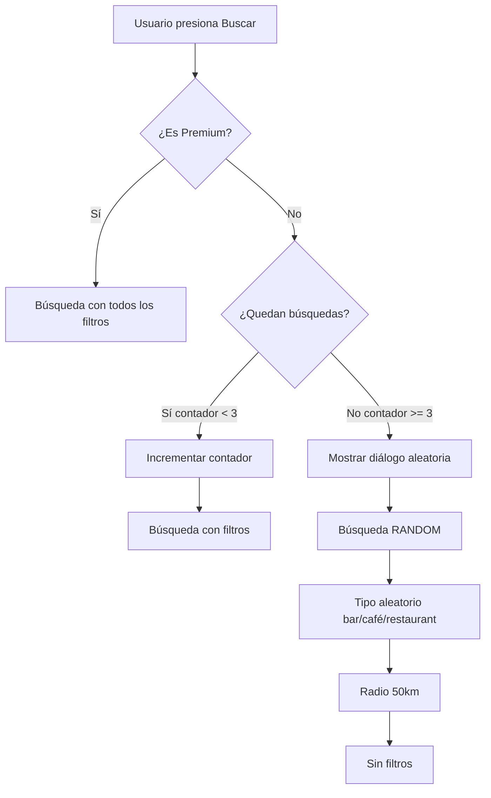

# 🎯 Sistema de Premium y Límites de Búsqueda

## 📋 Resumen

Se ha implementado un sistema completo de **planes gratuito y premium** con las siguientes características:

### 💰 Precio Premium
- **$30 MXN/mes** (actualizado desde $4.99 USD)

---

## 🆓 Plan Gratuito

### Características

#### 🏷️ Insignia Visual
- **Diseño**: Etiqueta simple "GRATUITO" sin brillos ni animaciones
- **Colores**: Gris apagado (`AppColors.textMuted`)
- **Ubicación**: Encima del botón de filtros en el Dashboard

#### 🔍 Límite de Búsquedas con Filtros
- **Límite diario**: 3 búsquedas con filtros por día
- **Contador visible**: Muestra "X/3 con filtros" en tiempo real
- **Reseteo automático**: El contador se reinicia cada 24 horas

#### 🎲 Búsquedas Aleatorias (después del límite)
Cuando un usuario gratuito alcanza las 3 búsquedas, las siguientes búsquedas son **completamente aleatorias**:

- ✅ Tipo de lugar aleatorio (bar, restaurante o café)
- ✅ Radio extendido a 50km
- ✅ Sin aplicar filtros de:
  - Horario
  - Compañía
  - Rango de precios
  - Distancia específica
- ✅ Mensaje informativo explicando la situación

#### 📱 Experiencia de Usuario
1. Usuario abre filtros y realiza búsqueda → Contador: `0/3`
2. Segunda búsqueda → Contador: `1/3`
3. Tercera búsqueda → Contador: `2/3`
4. Cuarta búsqueda → Contador: `3/3` + ⚠️ Diálogo: "Búsqueda aleatoria"
5. Búsqueda completamente aleatoria (ignora todos los filtros)

---

## ⭐ Plan Premium

### Características

#### 🏆 Insignia Visual
- **Diseño**: Etiqueta "PREMIUM" con gradiente dorado
- **Efectos**: Brillo, sombra, animación
- **Ubicación**: Encima del botón de filtros en el Dashboard

#### 🔓 Beneficios
1. **🚫 Sin anuncios** - Navegación sin interrupciones
2. **🔍 Búsquedas ilimitadas** - Sin límite de búsquedas con filtros
3. **🎯 Filtros avanzados** - Uso completo de todos los filtros
4. **⭐ Insignia exclusiva** - Badge dorado con brillo
5. **🎧 Soporte prioritario** - Ayuda prioritaria
6. **🚀 Acceso anticipado** - Nuevas funciones primero

---

## 🗄️ Cambios en la Base de Datos

### Nuevas Columnas en `users`

```sql
-- Contador de búsquedas con filtros usadas hoy
daily_filter_searches_used INTEGER DEFAULT 0

-- Última vez que se reseteó el contador
last_filter_search_reset TIMESTAMP WITH TIME ZONE DEFAULT NOW()
```

### Archivo SQL
📁 `database/premium_system_update.sql`

**Para ejecutar en Supabase:**
1. Ir al editor SQL de Supabase
2. Copiar y pegar el contenido del archivo
3. Ejecutar el script
4. Verificar que las columnas se crearon correctamente

---

## 🔧 Implementación Técnica

### Archivos Modificados

#### 1. `lib/presentation/screens/dashboard_screen.dart`
**Cambios principales:**
- ✅ Variables para rastrear búsquedas: `_dailyFilterSearchesUsed`, `_maxFreeFilterSearches`
- ✅ Método `_checkPremiumStatus()` actualizado para cargar contador
- ✅ Lógica de reseteo automático cada 24 horas
- ✅ Método `_incrementFilterSearchCounter()` para actualizar contador
- ✅ Método `_showInfoDialog()` para avisar sobre búsqueda aleatoria
- ✅ Modificación en `_searchRandomPlace()`:
  - Verifica límite antes de buscar
  - Si alcanzó límite → búsqueda aleatoria (tipo `'random'`, radio 50km)
  - Si no → búsqueda normal con filtros
- ✅ Widget `_buildFiltersToggle()` muestra:
  - Insignia GRATUITO/PREMIUM
  - Contador de búsquedas (solo gratuitos)
  - Botón de filtros

#### 2. `lib/presentation/screens/profile_screen.dart`
**Cambios principales:**
- ✅ Precio actualizado: `$30 MXN/mes` (línea ~290)
- ✅ Modal de premium muestra nuevo precio

#### 3. `lib/data/services/places_service.dart`
**Cambios principales:**
- ✅ Soporte para tipo `'random'` en búsquedas
- ✅ Cuando `placeType == 'random'`:
  - Elige aleatoriamente entre: `['restaurant', 'cafe', 'bar']`
  - Ignora filtros adicionales
  - Mayor radio de búsqueda

---

## 🎨 UI/UX

### Insignia Gratuito
```dart
Container(
  // Sin gradiente, sin sombra, sin brillo
  decoration: BoxDecoration(
    color: AppColors.textMuted.withOpacity(0.2),
    border: Border.all(color: AppColors.textMuted.withOpacity(0.3)),
  ),
  child: Text('GRATUITO', style: TextStyle(color: AppColors.textMuted)),
)
```

### Insignia Premium
```dart
Container(
  decoration: BoxDecoration(
    gradient: LinearGradient(
      colors: [Color(0xFFFFD700), Color(0xFFFFED4E)],
    ),
    boxShadow: [BoxShadow(color: Color(0xFFFFD700).withOpacity(0.5))],
  ),
  child: Text('PREMIUM', style: TextStyle(color: Colors.black)),
)
```

### Contador de Búsquedas
```dart
// Verde si quedan búsquedas, rojo si se agotaron
Container(
  color: hasSearchesLeft ? AppColors.primary : AppColors.error,
  child: Text('2/3 con filtros'),
)
```

---

## 🔄 Flujo de Búsqueda



---

## 📊 Queries de Monitoreo

### Ver estado de usuarios
```sql
SELECT 
    username,
    is_premium,
    daily_filter_searches_used,
    last_filter_search_reset,
    EXTRACT(EPOCH FROM (NOW() - last_filter_search_reset))/3600 as hours_since_reset
FROM users
ORDER BY is_premium DESC, daily_filter_searches_used DESC;
```

### Resetear contador manualmente
```sql
UPDATE users 
SET 
    daily_filter_searches_used = 0,
    last_filter_search_reset = NOW()
WHERE id = 'USER_ID_AQUI';
```

---

## ✅ Checklist de Implementación

- [x] Actualizar precio a $30 MXN
- [x] Crear columnas en base de datos
- [x] Implementar contador de búsquedas
- [x] Implementar reseteo automático
- [x] Agregar insignia GRATUITO (sin estilo)
- [x] Agregar insignia PREMIUM (con brillo)
- [x] Mostrar contador en UI
- [x] Lógica de búsqueda aleatoria
- [x] Soporte para tipo 'random' en PlacesService
- [x] Diálogo informativo al alcanzar límite
- [x] Documentación SQL
- [x] Documentación del sistema

---

## 🚀 Próximos Pasos

1. **Ejecutar SQL en Supabase**
   ```bash
   # Ir a: Supabase Dashboard → SQL Editor
   # Ejecutar: database/premium_system_update.sql
   ```

2. **Probar la aplicación**
   - Usuario gratuito: Realizar 4+ búsquedas y verificar límite
   - Usuario premium: Verificar búsquedas ilimitadas
   - Verificar insignias se muestran correctamente

3. **Monitorear**
   - Revisar logs de búsquedas
   - Verificar que el contador se resetea cada 24h
   - Confirmar que usuarios premium no tienen límites

---

## 🐛 Troubleshooting

### El contador no se resetea
- Verificar que `last_filter_search_reset` existe en la tabla
- Confirmar que la lógica de 24 horas está funcionando
- Revisar logs: `debugPrint('Hours since reset: ...')`

### La búsqueda aleatoria usa filtros
- Confirmar que `placeType == 'random'` en PlacesService
- Verificar que `useFilters = false` cuando límite alcanzado

### Insignia no se muestra
- Verificar que `_isPremium` se carga correctamente
- Confirmar que `_buildFiltersToggle()` se llama en build

---

## 📞 Soporte

Si hay algún problema con la implementación:
1. Revisar logs en consola
2. Verificar que SQL se ejecutó correctamente
3. Confirmar que las columnas existen en Supabase
4. Revisar que `_checkPremiumStatus()` se llama en `initState()`
